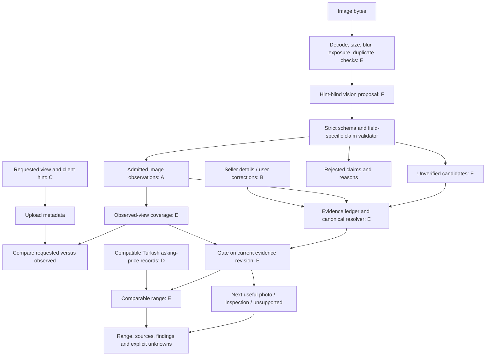

# TIRage: current system audit

Audit date: 12 September 2026. Local commit: `d0650a7f69a69dcd3ebac5308110c3a140b12845`.

Scope: current source, saved local evidence, parser/service reproductions, tests, build, and the user's reported phone failures. The attached requirements define the requested review; older project documents are design context, not proof of current behavior. This audit changes no application code or saved inspection data.

## A. Executive verdict

**NO: the current system is not ready for an uncontrolled demo with unseen judge photos.** The main problem is that the software can promote unsupported claims into evidence even when vision correctly describes the image. A better model cannot fix those transitions.

**Conditional path to readiness:** fix the P0 evidence boundaries below, demonstrate the regressions passing through the HTTP/UI path, and pass a small human-labeled visual evaluation. Until then, a successful F-MAX price demonstrates one working path, not reliable inspection.

The project has changed substantially. It now has a React/Vite frontend, an actual Anthropic adapter, evidence/gating logic, and Turkish listing data. The basic no-photo pricing gate exists; failed vision has a status; appraisal responses now include real comparable details and links; the route no longer silently assumes VAT excluded. These are meaningful improvements over the earlier scaffold.

One reported failure needs a precise correction: **`F-MAX` and `f-max` already compare equal at this commit.** In the saved demo session, old candidates including `R-series` and `Trucks (F-Max or similar)` keep the model conflicted. The UI shows only the agreeing seller/photo pair. Fixing lowercase handling alone will not solve this.

### Evidence and limits of this audit

| Check | Observed result | What it establishes |
|---|---|---|
| Local repository | Clean tracked state before audit documents; HEAD above | Findings refer to this checkout |
| GitHub connector | Repository lookup for `Funt-Sterling/54-kamion` returned 404 | Remote access/latest remote state/CI could not be verified; 404 does not prove the repo is absent |
| Backend parser, pricing, evidence tests | **35 passed**, mock adapter, explicit temporary DB/media | Existing unit behavior only |
| Data pipeline tests | **24 passed** with system Python | Existing parser/pipeline fixtures |
| Frontend tests | **34 passed** | Existing formatting/progress behavior |
| Frontend production build | Exit 0; Node 18.19.1 produced an unsupported-version warning | Bundle builds here; use a Vite-supported runtime, such as Node 22.12+ |
| Full backend HTTP test suite | Bounded run timed out in Starlette TestClient/AnyIO before vision | HTTP integration is **unverified**; this is not evidence of a Claude outage |
| Offline adversarial reproductions | Real parser, service and handler functions; scripted vision; isolated SQLite | Confirms the software flaws below independently of model quality |
| Real-image visual accuracy, mobile browser E2E, live model comparison | Not measured in this audit | No visual accuracy or end-to-end reliability claim is justified |

No paid model calls, new marketplace scraping, or production database writes were made. Existing tests mostly use synthetic images/scripted model output. They cannot establish that Claude reads a real badge or odometer correctly.

## B. Top systemic failures, ordered by severity

### 1. The requested view becomes coverage

`component_hint` is saved as `Media.component_tag`, then reused after successful analysis. Coverage credits that tag when upload/vision status succeeds. The model is also shown the hint. There is no independent observed-view contract.

**Reproduced:** request front exterior, return a tire finding → front is captured, tires are missing. The UI's wrong label follows the backend's wrong state; changing its label alone is insufficient. See [media.py:57](/home/funt1kk/zjui/FALL26/Hackathons/54/kamion/54-kamion/backend/app/routers/media.py:57), [media.py:145](/home/funt1kk/zjui/FALL26/Hackathons/54/kamion/54-kamion/backend/app/routers/media.py:145), [session_state.py:28](/home/funt1kk/zjui/FALL26/Hackathons/54/kamion/54-kamion/backend/app/services/session_state.py:28), [vision.py:175](/home/funt1kk/zjui/FALL26/Hackathons/54/kamion/54-kamion/backend/app/services/vision.py:175).

### 2. Parsed numbers and guesses become observed facts without support

The upload handler writes mileage, year, and axle output directly as `observed_from_photo`. There is no required readable odometer, unit, year plate, or axle geometry. Any nonempty badge text upgrades the unrelated model guess to a visual observation: scripted badge `SCANIA` plus model guess `F-MAX` admits observed F-MAX.

**Reproduced:** mileage `365000` becomes visual evidence while dashboard/odometer coverage remains missing. Separately, numeric JSON `365000.0` becomes `3650000` after punctuation stripping. Invalid/missing finding visibility defaults to **clear**. These are parser/admission bugs, not model limitations. See [media.py:161](/home/funt1kk/zjui/FALL26/Hackathons/54/kamion/54-kamion/backend/app/routers/media.py:161), [media.py:173](/home/funt1kk/zjui/FALL26/Hackathons/54/kamion/54-kamion/backend/app/routers/media.py:173), [vision.py:283](/home/funt1kk/zjui/FALL26/Hackathons/54/kamion/54-kamion/backend/app/services/vision.py:283), [vision.py:308](/home/funt1kk/zjui/FALL26/Hackathons/54/kamion/54-kamion/backend/app/services/vision.py:308).

### 3. The public details API lets a caller choose visual provenance

`EvidenceIn.provenance` is client-controlled and stored directly. A details request can create `observed_from_photo` with no supporting media. The ordinary frontend currently sends `seller_declared`, but that does not protect the server boundary. Restrict declaration fields and assign their provenance on the server. See [schemas.py:14](/home/funt1kk/zjui/FALL26/Hackathons/54/kamion/54-kamion/backend/app/schemas.py:14), [sessions.py:62](/home/funt1kk/zjui/FALL26/Hackathons/54/kamion/54-kamion/backend/app/routers/sessions.py:62).

### 4. The resolver discards strong contradictions and preserves weak ones

Only the newest visual value survives resolution, while all distinct inferred candidates remain. Two observed models, Actros then F-MAX, silently become F-MAX. An old inferred Actros followed by a readable F-MAX badge remains conflicted indefinitely. The conflict explanation hides candidates whenever an observed value exists.

Casing is already normalized for comparison; aliases `F Max`/`FMAX` are not. A 15% mileage tolerance also treats 850,000 and 1,000,000 km as agreement. Agreement with a seller is not independent verification. See [evidence.py:38](/home/funt1kk/zjui/FALL26/Hackathons/54/kamion/54-kamion/backend/app/services/evidence.py:38), [evidence.py:55](/home/funt1kk/zjui/FALL26/Hackathons/54/kamion/54-kamion/backend/app/services/evidence.py:55), [evidence.py:81](/home/funt1kk/zjui/FALL26/Hackathons/54/kamion/54-kamion/backend/app/services/evidence.py:81), [gate.py:145](/home/funt1kk/zjui/FALL26/Hackathons/54/kamion/54-kamion/backend/app/services/gate.py:145).

### 5. The gate accepts evidence too weak to select a price population

The gate blocks unknown/conflicting fields but accepts an `inferred_candidate` model. Its tractor check depends on accepted/successful media, without a persisted full-vehicle observation. A tire closeup must itself be called a tractor to survive analysis, yet that success can then stand in for truck identity.

**Reproduced:** inferred F-MAX plus seller axle/year and unsupported extracted mileage reaches `ready_to_price`. This can select a plausible F-MAX range for the wrong truck. See [gate.py:63](/home/funt1kk/zjui/FALL26/Hackathons/54/kamion/54-kamion/backend/app/services/gate.py:63), [gate.py:138](/home/funt1kk/zjui/FALL26/Hackathons/54/kamion/54-kamion/backend/app/services/gate.py:138), [media.py:136](/home/funt1kk/zjui/FALL26/Hackathons/54/kamion/54-kamion/backend/app/routers/media.py:136).

### 6. Retakes and failures can leave the session stuck or inconsistent

An earlier coverage attention state outranks a later clear photo. Historical tire/structural flags lack a resolution lifecycle. A vision-failed upload remains accepted and is included in duplicate lookup, so retrying the exact file is blocked. The frontend can display the new upload outcome while a failed session refresh leaves old coverage. There is no complete evidence-revision contract for keeping findings, eligibility, and price synchronized.

See [session_state.py:32](/home/funt1kk/zjui/FALL26/Hackathons/54/kamion/54-kamion/backend/app/services/session_state.py:32), [gate.py:89](/home/funt1kk/zjui/FALL26/Hackathons/54/kamion/54-kamion/backend/app/services/gate.py:89), [media.py:69](/home/funt1kk/zjui/FALL26/Hackathons/54/kamion/54-kamion/backend/app/routers/media.py:69), [App.tsx:106](/home/funt1kk/zjui/FALL26/Hackathons/54/kamion/54-kamion/frontend/src/App.tsx:106).

### 7. The market engine has useful data, but weaker guarantees than its mathematics may suggest

The CSV and local listing table contain **43 unique-source listings: 40 F-MAX and 3 Actros; all TR, TRY, 4x2, VAT unknown; none has image references**. Partitions are development 27, calibration 1, test 15. Current retrieval permits development plus calibration, giving **27 F-MAX and 1 Actros** before similarity selection. Actros cannot meet the five-comparable minimum.

Retrieval hard-filters category/model/configuration/country/VAT, but not currency or make, and has no maximum feature-distance or freshness cutoff. The all-TRY snapshot currently masks the currency defect. The range is computed from leave-one-out errors within the retrieved pool, not independent calibration. Do not describe it as a validated 90% prediction interval. See [pricing.py:73](/home/funt1kk/zjui/FALL26/Hackathons/54/kamion/54-kamion/backend/app/services/pricing.py:73), [pricing.py:96](/home/funt1kk/zjui/FALL26/Hackathons/54/kamion/54-kamion/backend/app/services/pricing.py:96), [appraisals.py:166](/home/funt1kk/zjui/FALL26/Hackathons/54/kamion/54-kamion/backend/app/routers/appraisals.py:166).

`unknown VAT == unknown VAT` means both sources omit tax information; it does not establish an equal tax basis. Keep the current source asking-price context usable with an explicit tax limitation, without calling it a tax-normalized valuation. Asking prices do not identify transaction prices, margin, or guaranteed proceeds.

## C. Current broken data flow

Source types: **A** supported visual observation; **B** seller declaration/user correction; **C** request/hint; **D** market record; **E** deterministic derivation; **F** model inference/proposal. A model response starts as F. Admission to A means a bounded, image-supported observation under the contract below, not independently established physical truth.

| Stage | Current mechanism | Incorrect trust transition or limitation |
|---|---|---|
| File chosen / request state | Capture screen maps next-photo target to `pendingHint` | C identifies what was requested, not what arrived |
| Multipart upload | Sends hint; both gallery and camera paths send `source=captured` | Capture origin is overstated; even camera origin is not authentication |
| Media creation | Stores hint as `component_tag` | C is placed in a field later treated as A |
| Quality checks | Blur/exposure/duplicate heuristics | E can identify some poor inputs, not prove semantics or honesty |
| Claude prompt | Includes uploader's component tag | C can bias F toward the expected view |
| Raw response / parser | Loose specs; numeric coercion; permissive visibility | Parsing success is mistaken for semantic support |
| `VisionResult` | No explicit multi-label observed views; broad booleans | Missing information cannot express partial truck versus wrong object reliably |
| Evidence creation | Any badge promotes model guess; specs become observations | F → A without claim-specific validation |
| Resolver | Newest observation, all candidates, broad numeric tolerance | E hides strong disagreement and perpetuates weak guesses |
| Coverage | Accepted + vision OK + component tag | C → visual coverage; findings do not repair it |
| Gate | Candidate satisfies required field; generic successful media establishes tractor | Weak E/F → pricing eligibility |
| Next photo | Uses polluted coverage and unresolved historical flags | Asks the wrong follow-up or loops despite improvement |
| UI | Renders backend tag; hides actual candidate conflict; mixed-provenance specs under visual heading | Wrong state becomes confident product language |
| Appraisal | Canonicalizes case for lookup, retrieves matching rows | Wrong identity selects credible-looking D; range arithmetic cannot repair identity |

Frontend references: [CaptureScreen.tsx:45](/home/funt1kk/zjui/FALL26/Hackathons/54/kamion/54-kamion/frontend/src/screens/CaptureScreen.tsx:45), [client.ts:99](/home/funt1kk/zjui/FALL26/Hackathons/54/kamion/54-kamion/frontend/src/api/client.ts:99), [format.ts:172](/home/funt1kk/zjui/FALL26/Hackathons/54/kamion/54-kamion/frontend/src/lib/format.ts:172), [EvidenceReview.tsx:179](/home/funt1kk/zjui/FALL26/Hackathons/54/kamion/54-kamion/frontend/src/screens/EvidenceReview.tsx:179).

## D. Corrected evidence architecture

### Minimum contract, not a large new framework

Separate `PhotoRequest.requested_view`, `Media.client_hint`, and `ObservedView`. Remove `component_hint` from the primary recognition prompt. The request is used **after** perception to explain a mismatch. A later targeted badge/odometer verification prompt may name its task, but cannot assume the requested object is present.

Use a versioned `VisionProposal` with only these groups:

| Group | Required meaning |
|---|---|
| Subject | `extent: whole/partial/none/unclear`; `category: tractor_unit/other_vehicle/nonvehicle/unknown` |
| Views | Required keys for front, rear, side, tire, dashboard, odometer, cab, chassis, badge; each `visibility: visible/absent/unclear` and `usable: boolean`; usable requires visible |
| Readings | Typed badge, total odometer, specification plate, or year plate; literal `raw_text`, explicit unit where applicable, readability, supporting region |
| Axle geometry | `visible_axle_count: integer or null`, `whole_relevant_geometry_visible: boolean`, supporting view/region; a complete count requires sufficient visible geometry, not a layout guess |
| Candidates | Make/model/configuration hypotheses with basis and references to readings/views; never silently observations |
| Findings | Component, visibility, localized observation, supporting region, limitation and action/severity; no monetary amounts |

Enums are closed, unknown fields rejected, missing required visibility is a schema error, absent/unclear data does not default to clear. Semantic rules run **after** schema validation. A malformed envelope admits nothing; an individually unsupported claim is rejected with a reason while independent valid observations can survive. Preserve image-level limitations rather than discarding `quality_issues`/notes.

Store `InferenceRun` metadata: image hash, model ID, prompt/schema version, bounded raw proposal, validation outcome, usage, latency and failure class. Keep this private; do not request/store hidden chain-of-thought. Regions must refer to original image coordinates with crop transforms recorded. A model-proposed region helps inspection but is not itself proof that the content exists there.

Every admitted claim retains media/run/support references, raw value, canonical value, display value, and lifecycle state. Keep observations immutable; use explicit supersession/retraction/dispute records. A new clear observation can supersede a weaker candidate about the same vehicle, but must not silently erase another supported contradictory observation. Seller edits supersede earlier seller declarations, not visual records. Repeated calls on the same image are not independent evidence.

For migration, existing `component_tag` values become **legacy request metadata**, never automatically observed views. Existing ungrounded specs need reanalysis or an unverified state. Preserve old reports as historical records; do not silently relabel them as newly validated.

Coverage is recomputed from active admitted views. A photo may credit several views. A resolved retake removes the coverage problem it actually resolves; unrelated clear photos do not dismiss structural damage. Increment a session evidence revision on material changes. Appraisal, findings snapshot, gate and UI must refer to that revision; hide/mark an old range stale while refresh fails or reanalysis is pending.

## E. Field-level evidence rules

| Field | Sufficient visual support (A) | B / F allowance and pricing consequence |
|---|---|---|
| Vehicle category | Usable whole-vehicle exterior showing a tractor unit; uncertainty retained | Tire/dashboard fragments contribute component evidence but cannot establish category. Wrong vehicle → unsupported; unclear → retake |
| Make | Readable manufacturer text consistent with vehicle; appearance is a candidate | Seller may declare; manufacturer badge alone does not prove model family |
| Model family | Readable model badge/text mapped to an approved family, consistent with make and exterior | Distinctive shape remains F. Candidate-only or seller-only family does not unlock the primary price for v1 |
| Year | Readable relevant manufacturer/document year field, with its meaning identified | Seller declaration allowed and disclosed. Registration year and inferred styling are not silently model year |
| Mileage | Odometer visible **and readable**; literal total-distance digits, unit and region; strict integer parsing | Seller declaration allowed as B, but v1 primary photo-led `priced` result waits for a supported reading. Displayed reading is not verified lifetime mileage |
| Axle configuration | Geometry supports **axle count**; readable specification evidence or sufficient drivetrain evidence is needed for driven layout | Two axles do not prove 4x2; three do not prove 6x2 versus 6x4. Declared layout can support a conditional range only with compatible visible count and explicit dependency |
| Front exterior | Actual usable front/three-quarter exterior observation | C/B cannot credit coverage; tire or badge crop is not a whole front view |
| Rear exterior | Actual usable rear observation | No inference from a front photo |
| Side profile | Relevant side geometry visible enough to assess body/axle count | Cropped wheel image is not a full side profile |
| Tires | Visible useful tread/sidewall closeup, scoped to tire(s) shown | Do not declare all tires good; exact tread depth needs scale/measurement |
| Dashboard | Usable dashboard view | Dashboard does not imply readable odometer |
| Odometer | Display visible; distinguish unreadable from readable | A readable odometer must credit odometer coverage. A tight crop need not credit wide-dashboard coverage |
| Cab interior | Usable interior view | Dashboard crop alone does not establish overall cab condition |
| Chassis/suspension | Usable visible chassis/suspension region | Mud/occlusion → unknown, not rust-free; never request unsafe under-truck access |
| Visible rust | Localized visible corrosion with image support; suspected versus clearly visible distinguished | Surface appearance cannot establish structural depth. Serious suspected structural issue → inspection |
| Visible body damage | Localized dent/crack/scratch with component and visibility | No visible damage in a region is not proof the entire truck is undamaged |

**Source permissions:** A can satisfy the relevant observed field/view. B can supply permitted declared specs but never visual coverage. C supplies task context only. D supplies listing claims and asking prices, never inspected-truck identity or condition. E can canonicalize, convert explicit units, resolve, score and gate; it cannot invent missing support. F can request verification or propose a candidate; model confidence alone cannot upgrade it to A.

Canonicalize by field using one registry shared by ingestion, resolution and retrieval: `F-MAX`, `f-max`, `F Max`, `FMAX` → `f-max`; `Actros`, `ACTROS` → `actros`. Keep `raw=F-MAX`, `canonical=f-max`, `display=F-MAX`. Do not globally lowercase findings or use fuzzy matching to merge different model families. Unknown aliases stay unresolved. Validate year/mileage/configuration types and limits server-side. Never strip arbitrary punctuation from floating-point input; reject ambiguous separators, trip readings or absent units. An explicit mile-to-kilometre conversion is E with its original reading retained.

Replace the 15% mileage agreement rule with exact normalized readings for the same inspection, plus an explicit discrepancy state. Legitimate later readings need timestamps/context, not a blanket tolerance. Label agreeing sources **“seller and photo agree”**, not “verified mileage.”

### Exact v1 requirements for `status=priced`

This is a deliberately conservative demo policy; it does not require every possible view before every range.

1. At least one current admitted usable whole-truck exterior supports tractor category. Closeups alone never suffice.
2. Make/family are grounded in readable identity evidence, compatible with the exterior and supported by the pricing population. Candidate-only identity fails this gate.
3. Valid year is supplied with provenance; it may be seller-declared. Mileage has a supported **total odometer** reading with known unit. Declared-only mileage can be saved, but the primary appraisal remains `needs_evidence`.
4. Configuration is supported by a readable specification or declared with compatible visible axle count. The latter must show “assuming seller-declared 4x2,” for example. When configuration is only declared, missing compatible visible axle-count evidence triggers a side-profile request.
5. No unresolved material seller/photo or photo/photo conflict, no suspected mixed-vehicle identity, and no unresolved serious structural concern. A concern can yield `inspection_required` with separate comparable context, not a personalized numeric quote.
6. Missing views remain explicit unknowns. An unresolved visual concern needing clarification returns `needs_evidence`; a suspected serious structural issue returns `inspection_required`. A clarified nonstructural finding may accompany the provisional market-reference range without an invented deduction. A missing view by itself does not mean damage; the range does not price hidden mechanical condition.
7. At least five **distinct vehicle groups**, after deduplicating listing/repost records and applying hard country=TR, currency=TRY, category, make/family, configuration and source/tax-policy checks. Unique URLs alone do not establish independent vehicles. Add development-defined freshness and maximum age/mileage-distance limits; do not widen them per query merely to reach five. No fallback to F-MAX for another family.
8. Both finite ordered range bounds exist. Range method and limitations are explicit, matched inputs and comparable links are available, and all output refers to the same current evidence revision. Non-current analysis cannot authorize a fresh quote.

`priced` here means **a provisional range of comparable asking prices**, not a calibrated transaction-price promise. If all available records omit VAT, label “source asking prices; VAT treatment not stated.” Do not claim net proceeds, guaranteed sale, or no-loss protection. Condition findings remain alongside the price until real repair-cost/transaction data supports financial adjustments.

The existing weighted median is a reasonable small-data baseline: distance uses year and log-mileage, weight is `1/(1+distance)`. Its current interval is a heuristic derived from those comparables. Keep it honestly provisional. Independent calibration must use a frozen development model/reference pool and a separate calibration partition; never use calibration rows as fitting neighbors during that evaluation or choose a model on the final test set. With one calibration row, a nontrivial finite 90% split-conformal interval is not supported. If the required finite-sample rank exceeds sample count, report insufficient calibration rather than clamp it and claim nominal coverage. See the [conformal prediction tutorial](https://arxiv.org/abs/2107.07511).

## F. Vision model strategy

**Use general-purpose Claude as the proposal generator, conditionally.** Do not let it own provenance, coverage, conflict resolution, or pricing eligibility. Deterministic validation catches inconsistent claims, not visually plausible hallucinations; human evaluation remains necessary.

The inspected configuration resolves to `VISION_ADAPTER=anthropic`, `VISION_MODEL=claude-sonnet-5` when loaded from the backend directory. The source default also names that model. A running process may have overrides; log its effective adapter/model and prompt version, never the API key. An API key alone identifies no model.

Official documentation currently lists image-capable Sonnet and Opus models including `claude-sonnet-5` and `claude-opus-5`. Confirm account access before benchmarking; do not assume availability from this listing. [Anthropic model overview](https://platform.claude.com/docs/en/models/overview).

The current adapter requests JSON in ordinary text. Provider structured output can enforce syntax/types; it does not establish that digits or a vehicle identity are true. Check the installed SDK and pin a compatible version before using the current schema API. Keep the application semantic validator either way. [Structured outputs](https://platform.claude.com/docs/en/build-with-claude/structured-outputs).

| Mechanism | Expected reliability gain | Effort | Latency / API cost | Decision and demo risk |
|---|---|---|---|---|
| Remove hint authority; field validators; lifecycle | High for reproduced errors | Medium | Negligible | **P0.** Biggest proven gain |
| Strict schema and trace metadata | High for malformed output and diagnosis | Low–medium | Small | **P0.** Still not semantic truth |
| Existing deterministic quality/duplicate checks | Useful but incomplete | Low to retain | Low / none | **P0.** Treat as heuristics; test dark/blur separately |
| Original-resolution badge/odometer crop | Potentially high on small text | Low–medium | One targeted pass when needed | **P1**, promote if the benchmark shows critical misses; reject invalid crop coordinates |
| Targeted second read | May catch disagreement | Medium | Additional call only on critical ambiguity | **P1.** Disagreement → abstain; agreement is correlated, not independent proof |
| OCR on odometer/badge ROI | Potentially useful for literal digits | Medium | Local compute or another service | **P1 only after measured gain.** OCR can read trip distance or wrong labels too |
| Stronger model everywhere | Unknown until evaluated | Low config effort | Model-dependent latency/cost | Benchmark first; no automatic upgrade |
| Train detector/segmenter; full ensemble | Unknown without labeled truck data | High | Training/serving overhead | **P2** |

Poor resolution, small text and approximate localization/counting are known limitations of general-purpose vision. Prefer original-quality crops to enlarging blurred pixels, and never promise image authenticity. [Anthropic vision documentation](https://platform.claude.com/docs/en/build-with-claude/vision).

Benchmark Sonnet versus an accessible Opus on the **same 20 human-labeled development images**, with identical schema, prompt, resizing and retry policy. Record output, model/version, accepted/rejected claims, token usage, actual cost and latency. Report view precision/recall, exact odometer reading/unit, model-family accuracy, unsupported-image acceptance, hallucinated fields and abstention. Use supported comparable generation settings; document differences that cannot be held constant. Pick the reliability/latency/cost tradeoff, freeze it, then run 20 untouched holdout images once.

Suggested bounded experiment: 40 comparison calls plus 20 holdout calls, **60 total and a team-configured cost ceiling**; retries count against both. No benchmark was run or paid for in this audit. Do not claim Opus is better until the paired results show it.

## G. Mini evaluation plan

Build **40 real, permissioned images today**, with human labels. The current 43-row listing dataset has no image references and is not this benchmark.

| Dominant scenario | Count |
|---|---:|
| Front / rear / side | 4 / 2 / 4 |
| Tire closeup | 4 |
| Dashboard / odometer | 3 / 6 |
| Cab / chassis / model badge | 2 / 3 / 3 |
| Dark or blurry | 3 |
| Cropped/partial truck | 2 |
| Wrong vehicle or irrelevant | 4 |
| **Total** | **40** |

These are sampling buckets, not exclusive labels. Label every image for every view. Include F-MAX, Actros/Scania, unreadable/tiny text, a misleading decal, and visible two/three-axle cases. If only 20 are available, call that a pilot; do not simultaneously tune and claim an independent final evaluation on the same images.

Manifest fields: image ID/path/hash, permission/source, vehicle group, split, human labeler/time, subject extent/category, view visibility/usability, literal badge/odometer reading and unit when readable, candidates that remain unknowable, visible localized findings, and forbidden claims. Hidden actual mileage/configuration is not a visual label. A human may label “unknown.” A second human adjudicates critical disputed readings. **Claude must not generate ground truth.** Unlabeled fixture rows remain explicitly unlabeled and cannot count as evaluated.

Split roughly 20 development / 20 blind by **vehicle**, with balanced scenarios. Crops, retakes and near duplicates stay in the same group. Prompt/model selection uses development only. Keep test images out of prompt examples.

Suggested acceptance targets, stated as targets rather than achieved results:

- **Zero critical false admissions**: invented mileage, unsupported family promoted to identity, wrong-view coverage, candidate-only price, or accepted non-truck price.
- View precision at least 95% and recall at least 80% across annotated view labels; also report counts per view and category, since easy absent labels inflate accuracy.
- Every admitted readable odometer result matches human digits and unit exactly. Separately report extraction/abstention counts; do not achieve apparent perfection by refusing all clear images.
- At least 80% of human-labeled clear supported identity/readout cases successfully return their expected usable result. Unsupported or visually unknowable configurations must abstain.
- All malformed/contradictory schema fixtures reject safely; duplicate requests do not add independent support.
- Report p50/p95 latency and cost per inspection from actual runs, with sample count. Show denominator zero as N/A, never 100%.

Twenty holdout images cannot validate rare-error rates. Even zero critical errors is a small-sample demo gate, not proof of marketplace reliability. Visual holdout tests and deterministic integration tests answer different questions; both are required.

## H. Demo-safe failure behavior

| Judge input / failure | Current risk | Required behavior and fix |
|---|---|---|
| Tire-only uploaded for front | Credits front from hint; may treat closeup as full identity | “Tire closeup detected; front still needed.” Credit tire only; preserve partial evidence |
| Motorcycle / irrelevant scene | Depends on broad model boolean; unsupported state can still receive irrelevant next requests | `unsupported`, no range, no truck coverage; offer another upload |
| Blurry or dark truck | Some deterministic checks; parser can still invent clear visibility | Reject unusable evidence with specific retake guidance; no guessed specs |
| Scania instead of F-MAX | Wrong candidate/badge promotion selects F-MAX pool | Preserve observed/candidate Scania; never substitute F-MAX; insufficient market data if identity is established |
| Tiny exterior badge | Guess gets promoted by any badge string | Candidate only; request closeup with wider association context |
| Misleading model decal | Readable text can be semantically misleading | Check make/model/exterior consistency; uncertain identity → additional view/review; acknowledge spoofing remains possible |
| 6x2 mistaken for 4x2 | Extracted layout unconditionally observed | Count geometry separately; conflicting declared count blocks; require configuration support/conditional declaration |
| Wrong seller mileage | 15% tolerance can hide discrepancy | Show both supported reading and declaration, mark conflict, request correction or clearer photo |
| Dashboard from another vehicle | Latest observation overwrites conflict; no authenticity proof | Preserve all active observations, detect identity/readout contradictions, flag uncertain association; do not claim fraud detection is solved |
| Dashboard with unreadable odometer | Can invent mileage or fail coverage | “Dashboard visible; odometer unreadable.” Credit dashboard, request closeup; mileage remains unknown |
| Repeat same successful photo | Duplicate rejection exists but source counting is weak | Explain already analyzed, reuse result, add no independent evidence |
| Repeat after API failure | Duplicate path blocks retry | Retry the same media with bounded/idempotent analysis; leave prior observations intact; no new visual evidence on failure |
| European / EUR comparable | Country filter rejects EU country, but TRY filter missing | Hard TR **and TRY** checks; missing/ambiguous country/currency excluded; no implicit FX conversion |
| Unsupported family / sparse Actros pool | Can display generic next-photo advice even after market failure | “Inspection available; too few compatible Turkish listings for a range.” Do not ask for a photo that cannot fix data scarcity |
| Timeout/network/schema failure | New upload and stale session can diverge | Explicit retryable analysis state; keep known evidence, hide stale range, no mock result fallback |
| Clear successful image | Can be dominated by earlier failure/candidate | Admit supported views/readings, resolve only the issue it addresses, show exact evidence and remaining gaps |

Allow users to dispute a view/spec or declare a correction. Store `user_corrected`/`seller_declared` with actor and reason; it may mark a proposal disputed or guide the next capture. A “yes, this is a tire” button must not manufacture a machine-verified view. Provide corrections for wrong known values, not only empty/conflicted fields.

The UI should show requested view and detected usable views separately, label source per field, expose the actual participants in a conflict, and link each finding to its image. Replace the mixed-provenance heading “What we can actually see” with “Vehicle details and sources.” Show “Ready for a provisional range” only from the gate, not because `next_photo` is null. Rename the weighted-median “Midpoint” to “Comparable estimate.” Current image previews/session state are browser-memory-only; reload/resume needs explicit handling before a phone demo that relies on refresh.

Next-photo selection can remain deterministic: resolve identity/category first, then contradictions and required readings/configuration, then an open condition concern. Explain the missing fact each request would resolve. Do not pretend this is a learned information-gain policy. Stop requesting photos when the blocker is market coverage or a required physical inspection.

## I. P0 / P1 / P2

### P0 — before showing unseen photos to judges

1. Write RED regressions for the reproduced failures. Fix test isolation first: the current imported engine plus destructive fixture can target the wrong database unless temporary settings exist before imports. Preserve the user's database/media.
2. Separate hint/request from observed views; strict proposal + claim validator; server-owned provenance; correct integer parsing; explicit unknown visibility.
3. Implement canonical identities and evidence lifecycle; truthful contradictions; observation-only coverage; recoverable retakes/retries; candidate-only identity cannot price.
4. Enforce the exact gate in section E and evidence revisions. Preserve unsupported/failed/inspection-required outcomes throughout the UI. Fix camera/gallery source labeling.
5. Add hard currency/make/support filtering and honest provisional/VAT wording. Freeze the existing source data; no new scraper is necessary to prove these changes.
6. Build human labels and run the small real visual benchmark; require separate HTTP/UI regression verification. Diagnose the TestClient stall rather than marking unexecuted tests green. Pin a supported Node runtime.

### P1 — after P0 works

- Targeted original-resolution crops and an optional verification call for badge/odometer; add OCR only if measured failures justify it. Escalate this to a release blocker if P0's visual benchmark fails critical reads.
- Durable session resume/image access, clearer localized finding overlays, retry/idempotency polish and per-run telemetry.
- Better listing deduplication, real tax metadata, external validation, condition labels and more supported families. Keep source permissions/provenance explicit.
- If scraping resumes, fix the current adapter's continuation after HTTP 403/429 and replace the sponsor email in its user-agent with an authorized team contact. Do not evade blocks. See [truckmarket_adapter.py:40](/home/funt1kk/zjui/FALL26/Hackathons/54/kamion/54-kamion/data_pipeline/sources/truckmarket_adapter.py:40) and [truckmarket_adapter.py:163](/home/funt1kk/zjui/FALL26/Hackathons/54/kamion/54-kamion/data_pipeline/sources/truckmarket_adapter.py:163).

### P2 — after judging

Custom vision training, broad component segmentation, learned next-view selection, live video/streaming, native-app migration, LiDAR/3D/metaverse work, vehicle authenticity claims, sale-time optimization and guaranteed-margin pricing. The current dataset is too small and lacks visual/transaction labels to justify these now.

### Explicit answers to the 15 requested questions

| # | Answer |
|---|---|
| 1. Most dangerous flaws? | Hint → coverage; unsupported specs → observed; caller-selected provenance; wrong candidate → pricing; lost photo conflicts. See B |
| 2. Claude limitations or our bugs? | Hint persistence, numeric corruption, false badge promotion, tolerance and resolver behavior are our bugs. Tiny text, occlusion, ambiguous identity and hallucination may be model failures; historical raw outputs are missing, so attribution of individual old photos remains uncertain |
| 3. Trust Claude as primary generator? | Conditionally as a proposal generator behind admission rules and human evaluation; not as the source of truth for the gate |
| 4. Layer before EvidenceRecord? | Strict schema plus semantic claim validator, supporting media/region references, canonicalization, rejection reasons and a versioned inference record |
| 5. Remove component_hint from prompt? | Yes for primary perception; keep it as request metadata for deterministic mismatch feedback |
| 6. Requested versus observed? | Separate request row/client hint from multi-label admitted observed-view rows; only the latter credit coverage |
| 7. Ground mileage? | Readable total odometer, literal digits, explicit unit, support region, strict parsing; no numeric claim without all support |
| 8. Ground axles? | Visible geometry establishes count, not driven layout; require specification/drivetrain evidence or disclosed declaration with compatible count |
| 9. Seller-declarable fields? | Make/model/year/mileage/configuration and commercial details can be stored as declarations. For v1 pricing, year and count-compatible configuration may remain declared; model identity and odometer reading require photo support |
| 10. Exact pricing conditions? | All eight requirements in E; otherwise needs evidence, inspection required, unsupported input, or insufficient market data, with no primary numeric range |
| 11. Benchmark Opus? | Yes if accessible, after fixing the evidence contract; identical 20-image paired development test, then a frozen holdout run |
| 12. OCR/crops/second pass? | Targeted crops first when reads fail; selective verification next; OCR only if a measured benefit justifies integration. None replaces field support |
| 13. Minimum evaluation today? | Prefer the 40-image human-labeled set in G. A 20-image pilot is useful but insufficient for both tuning and independent evaluation |
| 14. Graceful failures? | Wrong/unclear view, unreadable text, unsupported vehicle/family, contradictions, duplicate/retry, API failure, stale state and insufficient market data; all have explicit behavior in H |
| 15. Avoid before judging? | New-model training, LiDAR/metaverse, video/native rebuild, broad scraping, elaborate ensembles, invented repair deductions and guarantees about actual sale price |

## J. Implementation handoff

The second requested artifact is the [ready-to-paste Claude Code + ECC master prompt](/home/funt1kk/zjui/FALL26/Hackathons/54/kamion/54-kamion/docs/audits/2026-09-12-claude-ecc-master-prompt.md). It defines RED tests, scoped ownership, fresh reviews and final verification. These fixes are **proposed**, not implemented by this audit.
