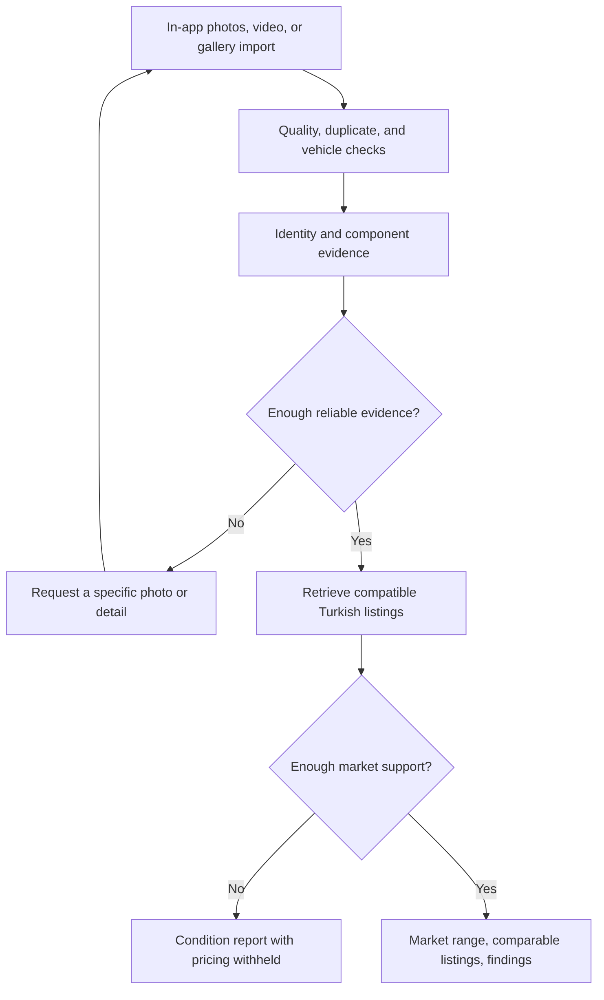

# Kamion Inspect: guided truck appraisal with evidence

> Status note (see commit history / PR description for the up-to-date decision log): the platform choice below (React Native) is being reconsidered in favor of a mobile-responsive web app for v1 — see `docs/frontend-brief.md` for the reasoning. Everything else on this page reflects the team's plan as agreed.

## 1. Product direction and research

**Build a mobile inspection assistant that tells users what it can see, what comparable trucks cost, and which additional photo would make the appraisal more useful.**

The seller captures a tractor unit through the app. Guidance updates every few seconds. The result gives a Turkish market price range, photo-linked condition findings, comparable listings, and explicit unknowns. Buyers can inspect the reasoning before deciding whether to visit the truck.

The strongest demonstration is:

> Poor photo → specific retake instruction → useful truck evidence → comparable market range → visible condition findings → targeted follow-up.

**What the files establish:** the Markdown brief and XMind contain the same challenge. There is no dataset or application code, and the folder is not currently a usable Git repository. The attached `gpt-6-astra.md` contains assistant operating instructions; it does not add product requirements. Following your clarification, the team will collect its own demo photos, while still testing on unseen vehicles.

Your ideas have useful industry precedents:

| Reference | What we should borrow |
|---|---|
| [Ravin mobile inspection](https://www.ravin.ai/blog/digital-vehicle-inspection-app) describes guided walkarounds, selected video frames, and separate detail captures. | Treat video as a convenient way to collect clear, complementary evidence. |
| [Hertz's UVeye announcement](https://newsroom.hertz.com/articles/article-details/hertz-and-uveye-partner-to-modernize-vehicle-maintenance-with-ai-technology/) describes body, tire, and underbody inspection using dedicated cameras. | Capture quality matters. Its scanner capabilities do not establish smartphone accuracy. |
| [Volvo's used-truck guidance](https://www.volvotrucks.com/en-en/news-stories/insights/articles/2019/sep/thinking-of-buying-a-used-truck-here-is-what-you-should-consider.html) emphasizes specifications, history, and inspection. | Photos contribute evidence, while mileage, configuration, and maintenance history remain important. |

These are product precedents and manufacturer guidance, not proof of our model's performance.

**Training:** use pretrained vision for observations. Build a mathematical pricing baseline from your own listings. Training a small pricing model is worthwhile only if it beats that baseline on held-out vehicles. Training a vision model from scratch is outside this hackathon's scope.

**LiDAR and metaverse:** defer both. Ordinary phone cameras, guided coverage, evidence attribution, and uncertainty handling directly address the challenge and are easier to demonstrate on both platforms.

## 2. Inspection and appraisal pipeline

**Capture and feedback**

- Support guided still photos, recorded walkaround video, and gallery import through the app.
- During capture, submit a selected frame approximately every three seconds, with only one feedback request in flight. Drop superseded frames so guidance stays current.
- Give actionable prompts: "Move back to include the cab," "This tire is too dark," or "Capture the dashboard mileage."
- For uploaded video, extract candidate frames, reject poor and repetitive frames, and retain at most 12 complementary images. Preserve timestamps.
- Use full-resolution stills or extracted frames for final findings; preview frames primarily guide capture.
- Record whether evidence was captured or imported. In-app capture establishes session provenance, not authenticity.

**What to photograph**

The component checklist follows [CVSA inspection guidance](https://cvsa.org/wp-content/uploads/International-Roadcheck-Vehicle-Inspection-Cheatsheet.pdf), used as a technical reference rather than Turkish regulatory certification.

| Evidence | Useful observations | Limits |
|---|---|---|
| Front, rear, sides, and oblique exterior views | Vehicle category, badges, configuration, body damage, lights, mirrors, glass | Exact year or trim may remain uncertain. |
| Tire tread and sidewall close-ups | Visible cuts, bulges, apparent uneven wear | No invented tread depth, pressure, or remaining life. |
| Exposed chassis, suspension, and fifth wheel | Visible corrosion, deformation, missing components | Hidden damage and functional condition remain unknown. |
| Dashboard and odometer | Displayed mileage and visible warning indicators | Displayed mileage is not verified lifetime mileage. |
| Cab interior | Seat, control, and trim wear | Wear alone cannot establish mechanical condition. |

Only request views accessible while standing safely beside the stationary vehicle.

Each finding contains: **component, observation, supporting photo/frame, visibility, and recommended next action**. Use "No obvious damage visible in this view," never "mechanically sound."

**Decision rules**

- Reject unsupported objects and unusable evidence before pricing.
- Distinguish a non-truck from a supported truck with insufficient photos.
- Flag conflicting vehicle identities or specifications across images.
- Extract visible details first; request confirmation only for unresolved pricing inputs.
- Keep seller declarations separate from observed evidence.
- Prioritize follow-ups in this order: pricing blockers, unresolved suspected damage, missing component coverage.
- Withhold an individual appraisal for suspected major structural damage or damage outside the pricing data's coverage. Comparable market context may still be shown, clearly labeled.

Do not display an arbitrary "condition score" or treat the vision model's self-reported confidence as a calibrated probability.

**Mathematical pricing**

The initial target is **current Turkish asking price**, conditional on the available specifications. Listings cannot establish completed-sale value.

1. Filter comparables by tractor-unit category, model family, axle configuration, Turkish location, and compatible VAT basis.
2. Rank remaining listings by normalized differences in age and log mileage.
3. Select up to ten nearest listings; require at least five compatible examples.
4. Compute a similarity-weighted median:

w_i = 1 / (1 + d_i),  P_hat = weightedMedian(P_i, w_i)

Here, d_i is the documented feature distance. Scaling is learned from development data. Similarity weights are engineering choices, not confidence probabilities.

Calibrate a range using held-out log-price errors:

r_j = |log P_j - log P_hat_j|,  [L, U] = [P_hat * e^-q, P_hat * e^q]

Use the finite-sample conformal residual quantile for a nominal 90% interval. This relies on distributional assumptions and gives marginal—not individual-truck—coverage. Report measured coverage and width on untouched test vehicles, including the accepted subset. Until validated, label the range **provisional**. [Conformal prediction reference](https://arxiv.org/abs/2107.07511)

Visible defects appear beside the range. **No invented monetary deductions.** Severe or unsupported condition differences trigger withholding rather than a fabricated adjustment.

For the 48-hour version, compare a small CatBoost model on log asking price against the baseline using development-only validation. Promote it only if price error improves without degrading interval usefulness. [CatBoost paper](https://arxiv.org/abs/1706.09516)

## 3. Data and implementation

**Turkish market dataset**

Target **200–400 distinct, usable tractor-unit listings**, initially concentrated in the three model families with the most accessible data.

Store source URL, collection date, listing date when available, vehicle location, make/model, year, mileage, axle configuration, asking price, currency, VAT basis, and permitted image references.

Important collection rules:

- Filter actual vehicle location. A Turkish-language site is not necessarily Turkish inventory: [Truck1's listings](https://www.truck1.com.tr/cekiciler/tumu) include both Turkish and foreign trucks.
- Preserve original currency and VAT basis. Any conversion must record its rate and date; never silently combine incompatible tax bases.
- Exclude deposits, lease payments, "price on request," new vehicles, and salvage listings from the standard used-truck baseline.
- Deduplicate reposted vehicles and near-identical photos before splitting data.
- Reserve approximately 60% for development, 20% for calibration, and 20% for final testing. Keep all evidence from one vehicle in one partition.
- Keep final-test vehicles out of the comparable retrieval pool during evaluation.

Use permitted dealer inventory, authorized exports, or sources whose terms allow the intended collection. Do not assume Sahibinden is available: its [published terms](https://www.sahibinden.com/sozlesmeler/bireysel-hesap-sozlesmesi-0) restrict collection and AI use without permission.

**Hour-four checkpoint:** demonstrate one working source adapter and at least 50 clean records. If coverage is sparse, restrict pricing to the best-supported family. If no usable source is available, data acquisition is a real blocker; synthetic prices must not be presented as market evidence.

**Architecture**

- **Mobile:** React Native, TypeScript, Expo development builds, and VisionCamera for camera/video frame access; Expo ImagePicker for imports. Test Android and iPhone. VisionCamera exposes photo, video, and frame outputs; simultaneous capture must be proven on the actual devices early. [Camera output documentation](https://visioncamera.margelo.com/docs/camera-outputs)
- **Backend:** Python/FastAPI, OpenCV for image checks, FFmpeg for uploaded video frames, and a paid multimodal API behind a replaceable adapter.
- **Storage:** SQLite for sessions and listings, private media storage, and one background worker. No microservice infrastructure.
- **Deployment:** one HTTPS backend; secrets remain server-side. Use a versioned local market snapshot during the demo rather than live scraping.
- **Reliability:** persist captured media across retries, cap uploads, validate actual file types, and return clear timeout/error states. Cached demonstrations must be labeled.

**Minimum API contract**

See `docs/api-contract.md` for the concrete request/response shapes implemented in `backend/`.

| Interface | Responsibility |
|---|---|
| `POST /sessions` | Start one vehicle inspection. |
| `POST /sessions/{id}/media` | Accept a photo, video, or sampled frame. |
| `GET /sessions/{id}` | Return progress, coverage, findings, and next capture instruction. |
| `PATCH /sessions/{id}/details` | Record confirmed or seller-declared specifications with provenance. |
| `POST /sessions/{id}/appraisals` | Produce a versioned appraisal from the current evidence. |

Appraisals return `priced`, `needs_evidence`, `unsupported`, `insufficient_market_data`, or `inspection_required`, plus reasons. Numeric outputs come from pricing code; written explanations reference stored evidence and comparables.

## 4. Frontend brief

See `docs/frontend-brief.md` — includes a platform recommendation update (mobile web over native RN for v1).

## 5. Delivery, testing, and acceptance

**Working assumptions:** 24–48 hours, 2–4 people, paid API access, both phone platforms, no guaranteed access to a real truck. Photos are the priority; periodic capture guidance and recorded video remain core features.

| Time | Deliverable |
|---|---|
| **Hours 0–4** | GitHub setup, shared API contract, camera/video sampling on both devices, first data-source checkpoint. |
| **Hours 4–12** | Data cleaning and baseline pricing; upload → quality check → findings; mobile capture screens. |
| **Hours 12–24** | Complete appraisal flow, video frame selection, follow-up guidance, comparables, and error handling. |
| **Hours 24–36** | Held-out evaluation, interval calibration, optional CatBoost comparison, and targeted fixes. |
| **Hours 36–48** | Device testing, deployment rehearsal, demo recording, documentation, and submission preparation. |

Assign four workstreams: mobile, inspection/backend, market data/pricing, and integration/evaluation. With two people, combine mobile with integration and backend with data.

**GitHub deliverable:** mobile/web, backend, data_pipeline, and evaluation directories. Include setup instructions, environment-variable examples, architecture, dataset provenance, limitations, and measured results. Keep keys, private media, and data without redistribution rights out of the repository. Make the repository accessible to judges before submission.

**Required tests**

- Motorcycle, passenger car, empty scene, darkness, blur, partial truck, mud, repeated views, mixed vehicles, and unsupported tractor configuration.
- Missing tires remain "unknown"; repeated photos do not increase coverage.
- New evidence can resolve uncertainty, reveal a defect, or widen the range—never force an automatic improvement.
- Currency, VAT, and vehicle-category mismatches never enter the same comparable group.
- Test vehicles and their reposts never appear in their own comparable evidence.
- Every published finding links to supporting media; every price explanation links to actual records.
- Camera permissions, interrupted recording, slow network, corrupt upload, and API timeout recover without losing the session.
- Measure asking-price error, interval coverage/width, acceptance rate, wrong-object acceptance, and human-reviewed finding precision.

Performance targets are feedback within roughly five seconds when connected and a final report within 30 seconds after upload. These are test targets, not claims until measured.

**Four-minute demonstration:** show a poor input and useful rejection; add better evidence; display comparable prices and photo-linked findings; then reveal an unresolved mechanical unknown. Use team-collected vehicles held out from development. If a recorded walkthrough is replayed, label it clearly.

The submission is the working app/backend, accessible GitHub repository, evaluation summary, and demo recording. Prepare the email package specified in the brief; sending it remains a separate team action.
